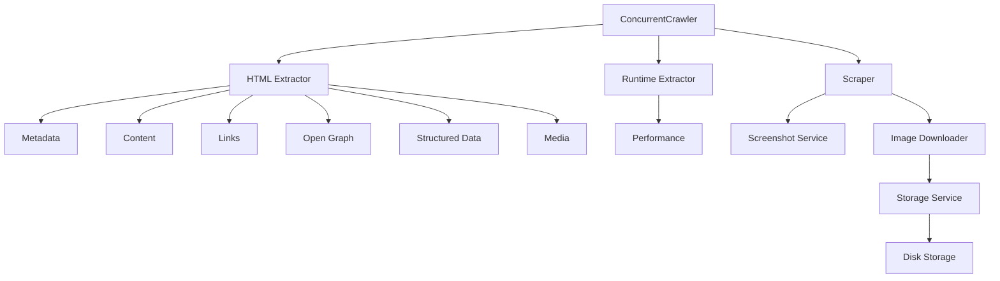

# Concurrent Web Crawler

A modular, concurrent web crawler built with **TypeScript**,
**Puppeteer**, and **Cheerio**. The crawler is designed around a
service-oriented architecture and performs **concurrent Breadth-First
Search (BFS)** crawling while extracting structured information from
websites.

------------------------------------------------------------------------

## ✨ Features

-   Concurrent BFS crawling using `p-limit`
-   Configurable maximum concurrency and page limit
-   Retry and timeout handling
-   Browser automation using Puppeteer + Stealth Plugin
-   Modular extractor pipeline
-   Runtime performance collection
-   Screenshot capture
-   Optional image downloading
-   Pluggable storage layer
-   JSON report generation for every crawled page

------------------------------------------------------------------------

## 🚀 Installation

``` bash
npm install
```

------------------------------------------------------------------------

## ▶️ Usage

``` bash
npm run start <base_url> <max_concurrency> [max_pages]
```

Example:

``` bash
npm run start https://example.com 5 200
```


| **Argument**    |   | **Description**                                |
|-----------------|---|------------------------------------------------|
| base_url        |   | Starting URL to crawl                          |
| max_concurrency |   | Maximum number of pages crawled simultaneously |
| max_pages       |   | *(Optional)* Maximum number of pages to crawl  |

 ------------------- ------------------------------------------------

## ⚙️ Configuration

The crawler can be configured through `config.json`.

``` json
{
    "DEFAULT_TIMEOUT": 30000,
    "ALL_TASKS_TIMEOUT": 30000,
    "HEADLESS": true,
    "MAX_PAGES": 100,
    "MAX_CONCURRENCY": 3,
    "SAVE_IMAGES": false,
    "IGNORE_SMALL_IMAGES": true,
    "SMALL_IMAGE_SIZE_KB": 2,
    "TAKE_SCREENSHOT": true
}
```

------------------------------------------------------------------------

## 🏗️ Architecture



------------------------------------------------------------------------

## 📦 Extractors

### HTML Extractor

-   Metadata
-   Content
-   Links
-   Open Graph
-   Structured Data (JSON-LD / Microdata)
-   Embedded Media

### Runtime Extractor

-   Navigation Timing
-   Paint Timing
-   Browser Performance Metrics

------------------------------------------------------------------------

## 🌐 Crawl Strategy

-   Breadth-First Search (BFS)
-   Concurrent crawling using `p-limit`
-   Same-domain crawling
-   Duplicate URL detection
-   Retry support
-   Graceful error handling

------------------------------------------------------------------------

## 📁 Output

Each crawled page generates

-   JSON report
-   Screenshot *(optional)*
-   Downloaded images *(optional)*

``` text
reports/
└── base_webpage/
    └── crawled_page/
        ├── report.json
        ├── screenshot.png
        └── images/
```

------------------------------------------------------------------------

## 📄 Sample Report

``` json
{
  "pageHtmlData": {
    "page_url": "https://learnwebscraping.dev/practice/ecommerce/products/ashenfang-longsword-fan-1001/",
    "metadata": {
      "url": "https://learnwebscraping.dev/practice/ecommerce/products/ashenfang-longsword-fan-1001/",
      "title": "Ashenfang Longsword | Fantasy Ecommerce Scraping Sandbox",
      "description": "Scrape Ashenfang Longsword in this fantasy ecommerce sandbox. Practice extracting price, rarity, specs, ratings, and product metadata.",
      "keywords": [],
      "canonicalUrl": "https://learnwebscraping.dev/practice/ecommerce/products/ashenfang-longsword-fan-1001",
      "robots": null,
      "language": "en",
      "charset": "utf-8",
      "favicon": null,
      "viewport": "width=device-width, initial-scale=1",
      "author": null,
      "generator": null,
      "themeColor": null
    },
    "content": {
      "title": "Ashenfang Longsword | Fantasy Ecommerce Scraping Sandbox",
      "headings": {
        "h1": [
          "Ashenfang Longsword"
        ],
        "h2": [
          "Specifications"
        ],
        "h3": [],
        "h4": [],
        "h5": [],
        "h6": []
      },
      "article": "\n        \n          Ecommerce\n          /\n          Categories\n          /\n          Longswords\n        \n\n        \n        \n\n        \n          FAN-1001\n          \n          Rare\n          A balanced battlefield blade with a smoldering fuller and leather-wrapped grip suited to mounted charges and evening duels.\n        \n\n        \n          \n            Current price\n            $184.00\n          \n          \n            Original price\n            $229.00\n          \n          \n            Stock status\n            In Stock\n          \n          \n            Rating\n            4.8/5\n          \n        \n\n        \n          Specifications\n          \n            \n              \n                Specification\n                Value\n              \n            \n            \n              \n                \n                  Critical chance\n                  +8%\n                \n              \n                \n                  Damage\n                  42 slash\n                \n              \n                \n                  Enchantment\n                  Ember edge\n                \n              \n                \n                  Weight\n                  3.8 kg\n                \n              \n            \n          \n        \n      ",
      "paragraphs": [
        "FAN-1001",
        "Rare",
        "A balanced battlefield blade with a smoldering fuller and leather-wrapped grip suited to mounted charges and evening duels."
      ],
      "lists": [],
      "blockquotes": [],
      "codeBlocks": [],
      "wordCount": 52,
      "readingTime": 1,
      "excerpt": "Scrape Ashenfang Longsword in this fantasy ecommerce sandbox. Practice extracting price, rarity, specs, ratings, and product metadata.",
      "byline": "",
      "dir": "",
      "siteName": "",
      "lang": "en",
      "publishedTime": ""
    },
    "links": [
      {
        "url": "https://learnwebscraping.dev/practice/ecommerce",
        "text": "Boot.dev Scraping Sandbox"
      },
      {
        "url": "https://www.boot.dev",
        "text": "Boot.dev"
      }
    ],
    "crawlable_links": [
      "https://learnwebscraping.dev/practice/ecommerce",
      "https://learnwebscraping.dev/practice/ecommerce/categories",
    ],
    "structured_data": [],
    "open_graph_data": {
      "images": [],
      "videos": [],
      "audios": [],
      "extras": {}
    },
    "media": [
      {
        "mediaType": "image",
        "src": "https://learnwebscraping.dev/images/catalog/longswords.svg",
        "alt": "Ashenfang Longsword fantasy catalog illustration",
        "title": "",
        "loading": "eager",
        "decoding": "async",
        "srcset": [],
        "sizes": null,
        "sources": []
      }
    ]
  },
  "pageRuntimeData": {
    "page_url": "https://learnwebscraping.dev/practice/ecommerce/products/ashenfang-longsword-fan-1001/",
    "performance_data": {
      "navigation": {
        "dnsLookup": 0,
        "tcpConnection": 0,
        "tlsHandshake": 0,
        "request": 233.10000000149012,
        "response": 2.3000000044703484,
        "domInteractive": 2249.7999999970198,
        "domContentLoaded": 2537,
        "loadComplete": 2622.10000000149,
        "totalPageLoad": 2622.10000000149
      },
      "paint": {
        "firstPaint": 2688,
        "firstContentfulPaint": 2688
      },
      "browser": {
        "documents": 8,
        "frames": 8,
        "nodes": 367,
        "jsEventListeners": 19,
        "layoutCount": 2,
        "recalcStyleCount": 3,
        "layoutDuration": 0.048379,
        "recalcStyleDuration": 0.019402,
        "scriptDuration": 0.015627,
        "taskDuration": 0.159138,
        "jsHeapUsedSize": 3016520,
        "jsHeapTotalSize": 5505024
      }
    }
  }
}
```

------------------------------------------------------------------------

## 💾 Storage

Current implementation

-   ✅ Disk Storage

Future backends

-   Amazon S3
-   Google Cloud Storage
-   Azure Blob Storage

------------------------------------------------------------------------

## 🛣️ Roadmap

### Core

-   [x] Concurrent BFS crawler
-   [x] Retry & timeout handling
-   [x] Configurable concurrency
-   [x] Screenshot capture
-   [x] Image downloader
-   [x] Pluggable storage layer

### HTML Extractors

-   [x] Metadata
-   [x] Content
-   [x] Links
-   [x] Open Graph
-   [x] Structured Data
-   [x] Embedded Media

### Runtime Extractors

-   [x] Performance Metrics
-   [ ] Network Extractor
-   [ ] Cookie Extractor
-   [ ] JavaScript Error Extractor
-   [ ] Console Log Extractor
-   [ ] Security Headers Extractor

### Downloader
-   [x] Image Downloader
-   [ ] Audio Downloader
-   [ ] Video Downloader
-   [ ] Streaming Media (HLS/DASH)

### Storage
-   [x] Disk Storage
-   [ ] Amazon S3
-   [ ] Google Cloud Storage
-   [ ] Azure Blob Storage

### Crawler

-   [ ] robots.txt support
-   [ ] Sitemap discovery
-   [ ] Persistent crawl queue
-   [ ] Resume interrupted crawl
-   [ ] Crawl statistics dashboard
-   [ ] Plugin system

------------------------------------------------------------------------

## 🛠 Tech Stack

-   TypeScript
-   Node.js
-   Puppeteer
-   Puppeteer Extra + Stealth Plugin
-   Cheerio
-   p-limit

------------------------------------------------------------------------

## 📄 License

MIT
